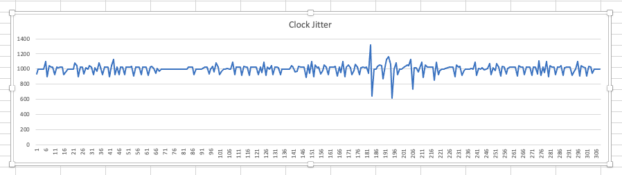
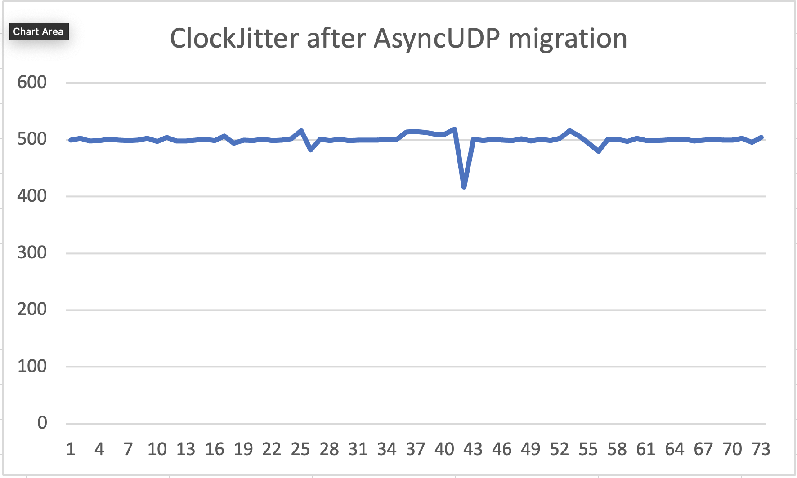

## sequence all.

A low code Sequencer firmware for the esp32.
Internal Communication, pattern matching and signal routing, is done making heavy use of the [CNMAT/OSC](https://github.com/CNMAT/OSC) library.

Changes of routes at Runtime is possible and will be implemented in the upcoming releases.

This application currently runs on only one core, so the second core is entirely unused and may be leveraged for other duties with few changes to the software.


# current state:


Clock Jitter before migration To AsyncUDP measured in Pure Data, logging timestamp of received osc message.
Log shows time elapsed between received messages, sent every 1000ms

ClockJitter after Migration. Clear improvement.

## How to find Sequencer in the network:

The sequencer advertises its services under sequenceall.local.

## Rest API

Following requests may be used to change credentials of the access point. STA Mode will be reimplemented in upcoming versions.
The credentials are stored in non volatile storage.

```
curl -XPOST -H "Content-type: application/json" -d '{"ssid" : "myApSSID" , "password" : "myApPassword"}' 'sequenceall.local/set_ap'

curl -XPOST -H "Content-type: application/json" -d '{"ssid" : "sequenceX" , "password" : "MySTAPassword"}' 'sequenceall.local/set_sta'
```

## Communication via OSC

The sequencer listens on `port 8000` for incoming OSC message of the syntax:

```
/{Element In Signal Chain}/{Optional: Number Of Element}/Action/{Optional: Position}
```
Currently following messages are implemented:
```
/voice/{1-voiceCount}/set/{1-sequenceLength}  uint8_t payload
/voice/{1-voiceCount}/mute/{1-sequenceLength}  uint8_t status //Bool seems not to be well supported by CNMAT/OSC code uses implicit cast
/voice/{1-voiceCount}/delete/{1-sequenceLength}  -

```
To subscribe to the OSCService of sequenceAll, send an OSC message of any content. The sender's IP address will be stored and will receive all OSC messages emitted from SequenceAll.

## Setup your sequencer

Any implemented functionality may be added through the sequenceAllBuilder. 
```c++
    SequenceAllBuilder sequenceAllBuilder;
    SequenceAll sequenceAll = sequenceAllBuilder
            .setClock()
            .setVoices(4)
            .setWifi()
            .setOSCService()
            .build();
```
To Implement your own functionality, inherit it from the Module class.

Modules may be routed by calling connectOutputToInput():
```c++
    sequenceAll.connectOutputToInput(
            sequenceAll.properties.getClock(),
            sequenceAll.properties.getVoiceContainer()
            );
```

### needed:

Short term goals:

- Add Keyboard
- implement switch internal and external clock
- extend rest(?) api
- and implementation of various I/Os, such as cv, midi, etc.

- save state of all voices to nvm.

- add STA functionality

### Current Limitations:

- only ap mode is supported
- clients connected receive all messages
- Only port 8000 is supported
- clients can send messages to host name
- ap name and password may be changed via post request.
- Changes will take effect after restart
